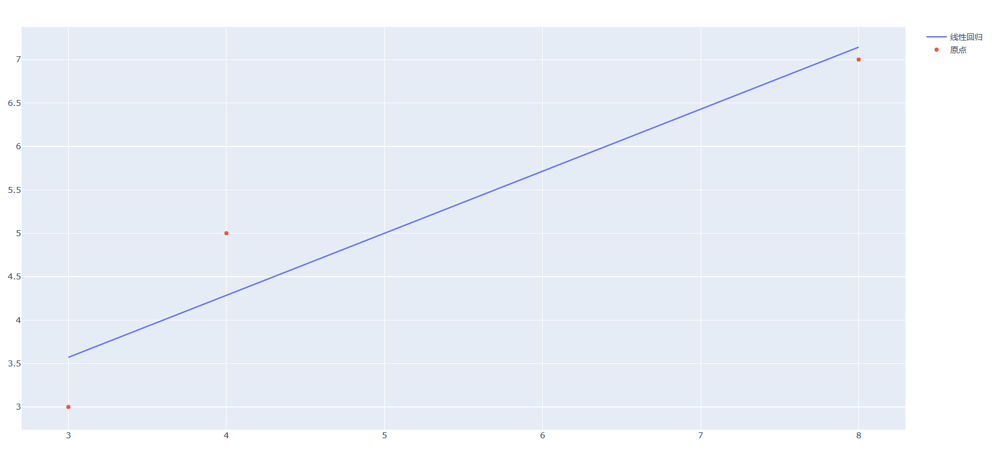

# 监督学习
- 广义线性模型

1. LinearRegression

```python
from sklearn import linear_model
import numpy as np

reg = linear_model.LinearRegression()
data_x = np.array([[3], [4], [8]])
data_y = np.array([3, 5, 7])
# 拟合模型
reg.fit(data_x, data_y)
print(reg.coef_)  # 斜率
print(reg.intercept_)  # 截距
```
    在上面的例子中我们可以进行下面的推演, 得到回归直线
```python
import numpy as np
from sklearn.linear_model import LinearRegression
import plotly.graph_objects as go

# 创建线性回归模型
reg = LinearRegression()

# 准备数据
data_x = np.array([[3], [4], [8]])
data_y = np.array([3, 5, 7])

# 拟合模型
reg.fit(data_x, data_y)

# 生成x的值
x = np.array([sum(i) for i in data_x])

# 预测y的值
y_pred = x * reg.coef_ + reg.intercept_

# 创建图表
fig = go.Figure(data=[
    go.Scatter(x=x, y=y_pred, mode='lines', name='线性回归'),
    go.Scatter(x=x, y=data_y, mode='markers', name='原点')
])

# 显示图表
fig.show()
```


