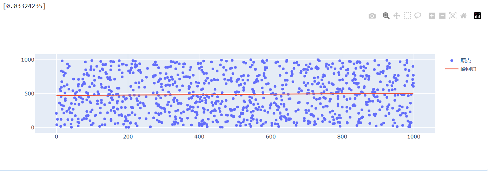
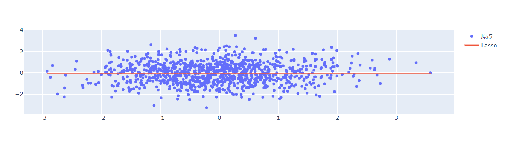
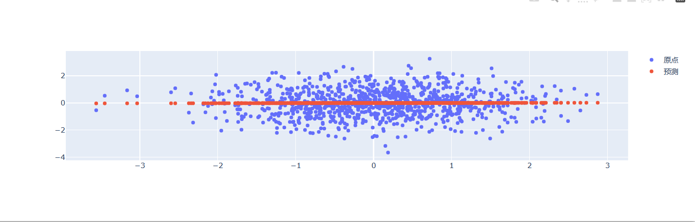
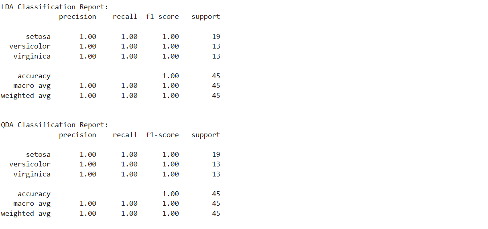
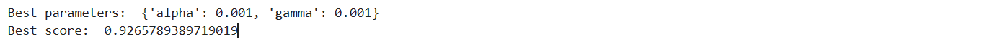
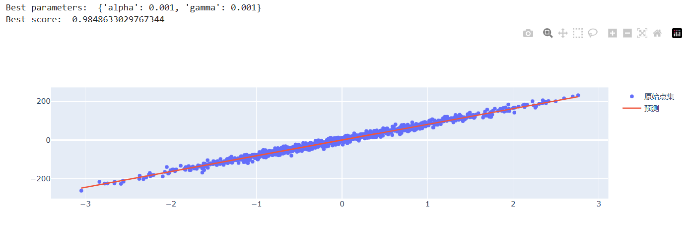

# 监督学习
- 广义线性模型

1. LinearRegression

```python
from sklearn import linear_model
import numpy as np

reg = linear_model.LinearRegression()
data_x = np.array([[3], [4], [8]])
data_y = np.array([3, 5, 7])
# 拟合模型
reg.fit(data_x, data_y)
print(reg.coef_)  # 斜率
print(reg.intercept_)  # 截距
```
    在上面的例子中我们可以进行下面的推演, 得到回归直线
```python
import numpy as np
from sklearn.linear_model import LinearRegression
import plotly.graph_objects as go

if __name__ == '__main__':

    # 创建线性回归模型
    reg = LinearRegression()
    
    # 准备数据
    data_x = np.array([[3], [4], [8]])
    data_y = np.array([3, 5, 7])
    
    # 拟合模型
    reg.fit(data_x, data_y)
    
    # 生成x的值
    x = np.array([sum(i) for i in data_x])
    
    # 预测y的值
    y_pred = x * reg.coef_ + reg.intercept_
    
    # 创建图表
    fig = go.Figure(data=[
        go.Scatter(x=x, y=y_pred, mode='lines', name='线性回归'),
        go.Scatter(x=x, y=data_y, mode='markers', name='原点')
    ])
    
    # 显示图表
    fig.show()
```


2. 岭回归

相对于普通最小二乘法， 可以防止过拟合，更健康
```python
import numpy as np
from sklearn import linear_model
import plotly.graph_objects as go

if __name__ == '__main__':
    # 随机产生实验数据
    data_x = [[np.random.randint(0, 1000, size=1)[0]] for i in range(1000)]
    data_y = np.random.randint(0, 1000, size=1000)

    # 更改参数，查看效果
    reg = linear_model.Ridge(alpha=0.5)
    reg.fit(data_x, data_y)
    x = [i[0] for i in data_x]
    print(reg.coef_)
    fig = go.Figure(data=[
        go.Scatter(x=x, y=data_y, mode='markers', name='原点'),
        go.Scatter(x=x, y=x * reg.coef_ + reg.intercept_, mode='lines', name='岭回归')
    ])
    fig.show()
```

3. Lasso

如果需要进行特征选择，Lasso可能是一个更好的选择
```python
import numpy as np
from sklearn import linear_model
import plotly.graph_objects as go

if __name__ == '__main__':
    # 随机产生实验数据
    data_x = [[np.random.normal(loc=0.0, scale=1.0, size=1)[0]] for i in range(1000)]
    data_y = np.random.normal(loc=0.0, scale=1.0, size=1000)
    # 更改参数，查看效果
    reg = linear_model.Lasso(alpha=0.5)
    reg.fit(data_x, data_y)
    x = [sum(i) for i in data_x]
    fig = go.Figure(data=[
        go.Scatter(x=x, y=data_y, mode='markers', name='原点'),
        go.Scatter(x=x, y=x * reg.coef_ + reg.intercept_, mode='lines', name='Lasso')
    ])
    fig.show()
```

4. 贝叶斯岭回归

    贝叶斯岭回归对病态问题（ill-posed）的鲁棒性要更好
```python
import numpy as np
from sklearn import linear_model
import plotly.graph_objects as go

if __name__ == '__main__':
    # 随机产生实验数据
    data_x = [[np.random.normal(loc=0.0, scale=1.0, size=1)[0]] for i in range(1000)]
    data_y = np.random.normal(loc=0.0, scale=1.0, size=1000)
    # 更改参数，查看效果
    reg = linear_model.BayesianRidge()
    reg.fit(data_x, data_y)
    x = [sum(i) for i in data_x]
    y1 = reg.predict(data_x)
    fig = go.Figure(data=[
        go.Scatter(x=x, y=data_y, mode='markers', name='原点'),
        go.Scatter(x=x, y=y1, mode='markers', name='预测')
    ])
    fig.show()
```


- 线性和二次判别分析（分类模型）

这里， 举个例子
```python
from sklearn import datasets
from sklearn.model_selection import train_test_split
from sklearn.discriminant_analysis import LinearDiscriminantAnalysis, QuadraticDiscriminantAnalysis
from sklearn.metrics import classification_report

if __name__ == '__main__':
    iris = datasets.load_iris()
    x = iris.data
    y = iris.target
    train_x, test_x, train_y, test_y = train_test_split(x, y, test_size=0.3, random_state=42)  # 控制随机过程的随机性
    # LDA
    ida = LinearDiscriminantAnalysis()
    ida.fit(train_x, train_y)
    y_pred_lda = ida.predict(test_x)

    # QDA

    qda = QuadraticDiscriminantAnalysis()
    qda.fit(train_x, train_y)
    y_pred_qda = qda.predict(test_x)

    # 打印LDA模型的分类报告
    print("LDA Classification Report:")
    print(classification_report(test_y, y_pred_lda, target_names=iris.target_names))

    # 打印QDA模型的分类报告
    print("\nQDA Classification Report:")
    print(classification_report(test_y, y_pred_qda, target_names=iris.target_names))
```
结果：

发现，可能是数据太过于简单， 结果一样

- 内核岭回归（线性回归）
对于非线性回归问题非常有效
```python
from sklearn.kernel_ridge import KernelRidge
from sklearn.model_selection import GridSearchCV
from sklearn.datasets import make_regression

# 生成一个回归数据集
X, y = make_regression(n_samples=100, n_features=1, noise=10, random_state=0)

# 创建内核岭回归模型
kr = KernelRidge(kernel='rbf', gamma=0.1)

# 使用网格搜索来寻找最佳的超参数组合
param_grid = {'alpha': [1e0, 1e-1, 1e-2, 1e-3],
              'gamma': [0.1, 0.01, 0.001, 0.0001]}
kr_grid = GridSearchCV(kr, param_grid=param_grid, cv=5)
kr_grid.fit(X, y)

# 输出最佳参数和得分
print("Best parameters: ", kr_grid.best_params_)
print("Best score: ", kr_grid.best_score_)
```
运行结果：


下面用它来做一个正太拟合和预测
```python
from sklearn.kernel_ridge import KernelRidge
from sklearn.model_selection import GridSearchCV
from sklearn.datasets import make_regression
from sklearn.model_selection import train_test_split
import plotly.graph_objects as go
if __name__ == '__main__':
    # 生成一个回归数据集
    data_x, data_y = make_regression(n_samples=1000, n_features=1, noise=10, random_state=0)
    X_train, X_test, y_train, y_test = train_test_split(data_x, data_y, test_size=0.3, random_state=42)
    kr = KernelRidge(kernel='rbf', gamma=0.1)

    # 使用网格搜索来寻找最佳的超参数组合
    param_grid = {'alpha': [1e0, 1e-1, 1e-2, 1e-3],
                  'gamma': [0.1, 0.01, 0.001, 0.0001]}

    kr_grid = GridSearchCV(kr, param_grid=param_grid, cv=5)
    kr_grid.fit(X_train, y_train)
    print("Best parameters: ", kr_grid.best_params_)
    print("Best score: ", kr_grid.best_score_)
    y_pred = kr_grid.predict(data_x)
    data_x = [sum(i) for i in data_x]
    fig = go.Figure(data=[
        go.Scatter(x=data_x, y=data_y, mode='markers', name='原始点集'),
        go.Scatter(x=data_x, y=y_pred, mode='lines', name='预测')
    ])
    fig.show()
```
运行结果：


可以看出，效果确实不错。